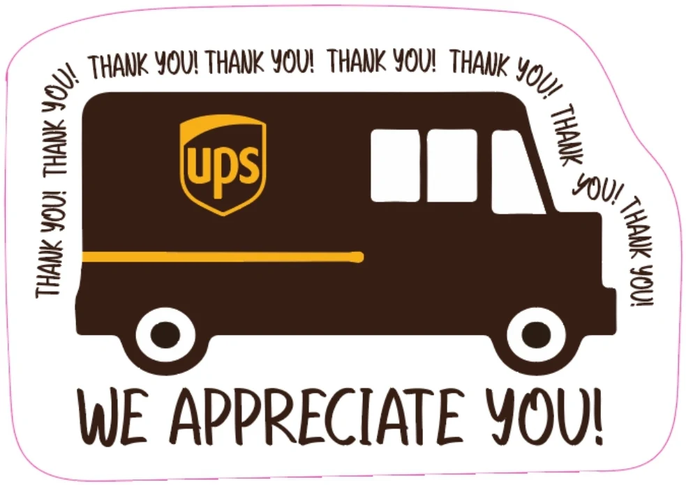

# UPS Crash Risk Predictor

<table>
<tr>
<td width="75%">

## For the Truckers!

## Objective
Develop a machine learning framework that predicts UPS delivery crash severity using FMCSA crash datasets and translates predictions into a driver-facing risk assessment tool.

## Dataset
- FMCSA Crash File
- FMCSA SMS Input Data

## Models Evaluated
- Logistic Regression
- Class-Weighted Logistic Regression
- Random Forest
- Random Forest with Engineered Features

## Final Model
**Random Forest with Combined Features**

## Deployment
🔗 https://huggingface.co/spaces/TommyT777/UPS-Crash-Risk

⚠️ <u><strong><em>Web App deployed on free hugging face,requires occasional re-run of code.</em></strong></u>
</td>

<td width="25%" align="center">

</td>
</tr>
</table>

## Paper publishing underway!
